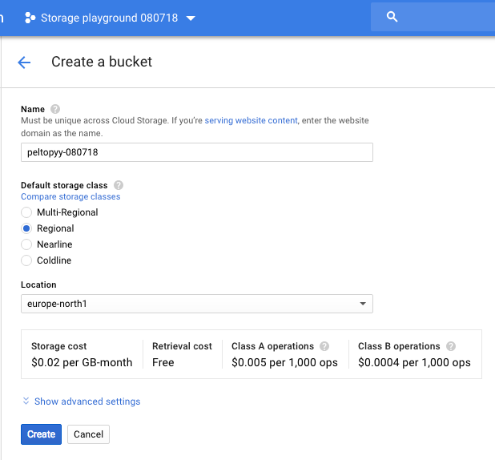
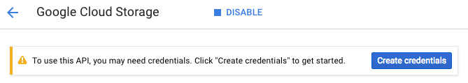
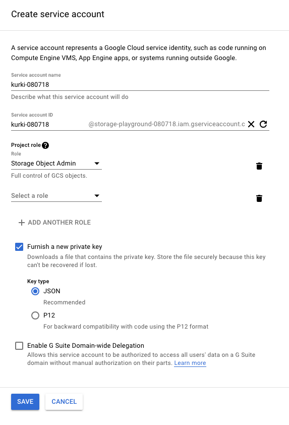

# Google Cloud Storage playground

Study of how Google Cloud Storage can be used from Scala, programmatically.

- writing
- watching for changes
- extracting the history of a key
- access rights; can we restrict access by bucket?

The focus is on features needed for a "slow data" adapter. E.g. writing multiple values atomically in a batch, over writing just a single value.


## Requirements

- `sbt`

### Setting up your Google Cloud 

Note: We're expecting some knowledge on handling the [Google Cloud Console](https://console.cloud.google.com/).

1. Create a project, and a service account for it.

  Store the key for the service account under `secrets/`, and export it as (a sample):
  
  `export GOOGLE_APPLICATION_CREDENTIALS=secrets/storage-playground-080718-961906980253.json 
  `

2. Create a Cloud Storage bucket

  Choose the project and in the "Storage" page, creat the bucket.
  
    

3. Enable "Storage API" and create service

  APIs & Services > Google Cloud Storage > enable
  
  It suggests you create credentials, first.
  
  

  You need to create a service account:

  

  Press `Save` and you'll get a JSON file that contains the private key needed to authenticate as the service account.
  
  Move the private key to a suitable location, e.g. `secrets/storage-playground-080718-523fc41d4fa1.json`.

  The "Storage Object Admin" has all the access we need. See [Cloud Storage IAM Roles](https://cloud.google.com/storage/docs/access-control/iam-roles) for the details.
  
4. Expose the service account key via an environment variable.

  `export GOOGLE_APPLICATION_CREDENTIALS=secrets/<your-key>.json`

  In the instructions below, we assume you have this env.var. set.  

5. Enable versioning for the bucket

  ```
  $ gsutil versioning set on gs://abc-080718/
  Enabling versioning for gs://abc-080718/...
  ```

  tbd. Not sure, whether this would be the default (`gsutil versioning get` said `suspended` for an empty bucket).


  
## Kick the tires  

### MainWrite

```
$ sbt 
...
> runMain main.MainWrite
...
18:02:09.016 [run-main-0] INFO main.MainWrite$ - Going to write 'abc-080718'
18:02:10.014 [run-main-0] INFO main.MainWrite$ - 'abc' created
```

Writes a single file to the bucket.

Note: 

>Google Cloud Storage does not support renaming buckets, or more generally an atomic way to operate on more than one object at a time. [^1]

[^1]: [How to upload multiple files to google cloud storage bucket as a transaction](https://stackoverflow.com/questions/14609007/how-to-upload-multiple-files-to-google-cloud-storage-bucket-as-a-transaction) (StackOverflow)

[ This means no atomic changes of multiple keys for AC, if Google Cloud Storage is the back-end. ]

<!-- idea. Maybe we can use metadata in a way to emulate atomicity?
-->

### MainWatch

Q: Can we watch changes in the bucket, and/or objects' metadata?


<!--
<font color=red>There does not seem to be a way to observe changes to Google Cloud Datastore, in a streamed way.</font>

This would still be fine - we can do e.g. once a second polling for new information, using the "cursor" mechanism. 


### History

<font color=red>Something mentioned "version" information, but in practise it does not seem to be there. If we cannot read the history of the data store, we don't get auditing. Less incentive to use Google Cloud Datastore. 
</font>

We could bypass this by simply storing the events in the Datastore, never writing over the existing stuff. But it deviates the view seen natively in the store from the abstraction it's providing. It doesn't feel right.


### Authentication

tbd.

### MainDelete

tbd.
-->

## References

- [Google Cloud Storage Documentation](https://cloud.google.com/storage/docs/)
  